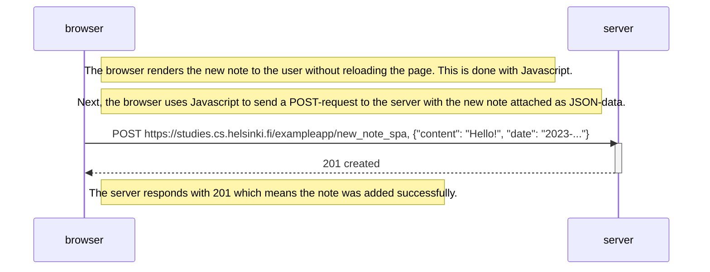

```mermaid
sequenceDiagram
    participant browser
    participant server
    
    Note right of browser: The browser renders the new note to the user without reloading the page. This is done with Javascript.
    
    Note right of browser: Next, the browser uses Javascript to send a POST-request to the server with the new note attached as JSON-data.
    
    browser->>server: POST https://studies.cs.helsinki.fi/exampleapp/new_note_spa, {"content": "Hello!", "date": "2023-..."}
    activate server
    server-->>browser: 201 created
    deactivate server
    
    Note right of browser: The server responds with 201 which means the note was added successfully.

```
